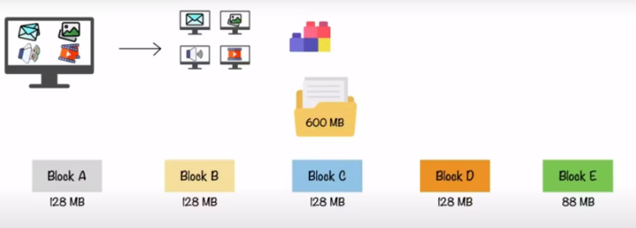
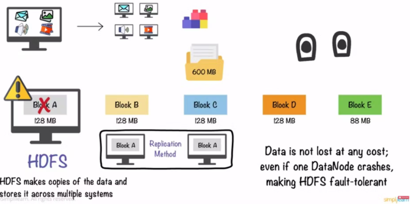
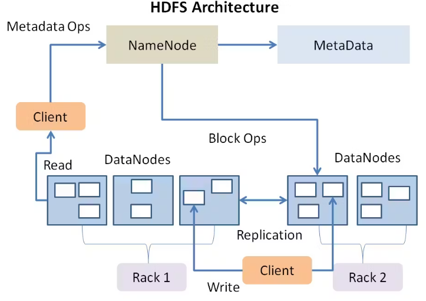
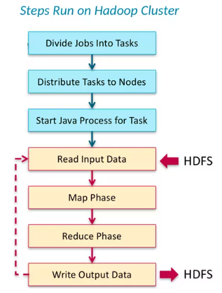
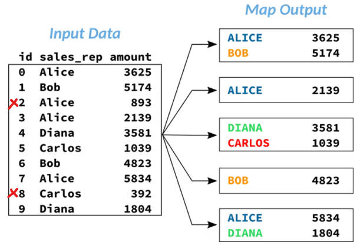
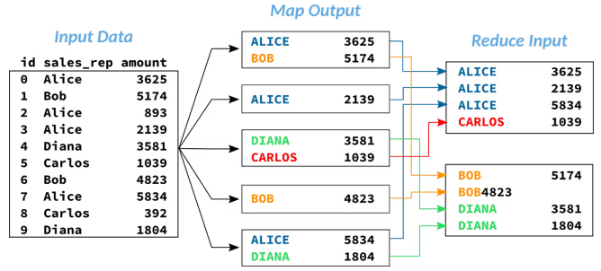
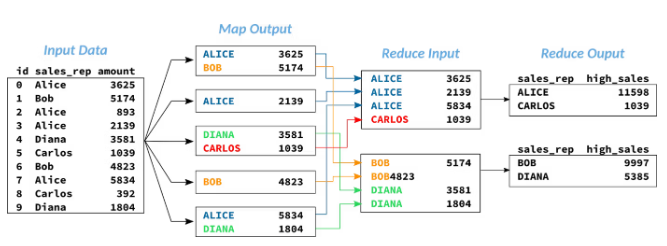
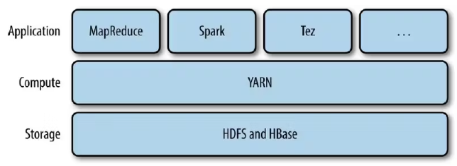
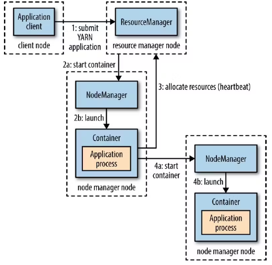
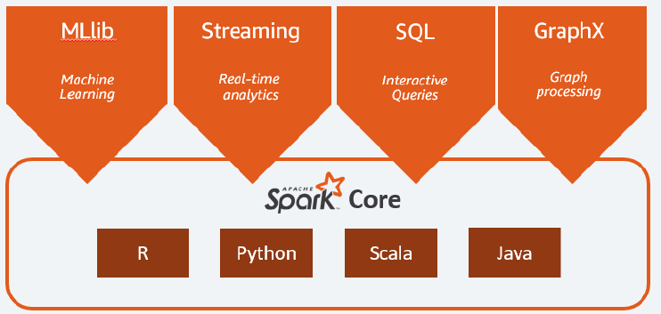

# Big Data

Peso de 25% na prova

---

## 1. O que é Big Data :white_check_mark:

> O que é Big Data, quais seus principais desafios (armazenamento, integração, análise e suporte "Fast Data").

É uma nova geração de tecnologias e arquiteturas, desenhadas de maneira econômica para extrair **valor** de grandes **volumes** de dados, provenientes de uma **variedade** de fontes, permitindo alta **velocidade** na captura, exploração e análise dos dados.

O contexto tradicional de bancos relacionais apresenta limitações em escalonamento, surgindo a oportunidade de realizar **computação paralela** usando hardware de baixo custo.

### 1.1) 5 Vs do Big Data

**Volume**: quantidades de dados na ordem de TB, PB;
**Variedade**: dados em diversos formatos diferentes (logs, DBs relacionais, JSON, IOT);
**Velocidade**: dados chegando de forma contínua;
**Veracidade**: é preciso extrair informações confiáveis dos dados para tomada de decisão;
**Valor**: só faz sentido ter uma infra de big data, se isso traz algum valor (financeiro, por ex.).

### 1.2) Fast Data

[Fonte](https://blog.dsacademy.com.br/fast-data-a-evolucao-do-big-data/)

Por muito tempo, o volume foi o foco no Big Data, mas cada vez mais o mundo muda de uma forma mais rápida, e para garantir competitividade, as empresas precisam extrair valor dos dados em formatos variados com maior velocidade.

Fast Data é coletar os dados em tempo real para tomada de decisão.

Em arquiteturas fast data, diferente do processamento batch tradicional feito durante a noite, os eventos individuais são processados à medida que chegam, na ordem de milissegundos (processamento de streaming).

---

## 2. Tipos de Processamento :white_check_mark:

> Quais os tipos de processamento de dados, ETL vs ELT e análise de complexidade e aplicabilidade em cenários reais.

**ETL**: Extract-Transform-Load - primeiro você extrai os dados de um sistema origem, transforma esses dados que estão em formato raw (muitas vezes sem estrutura) e os deixa mais legíveis para serem trabalhados pelo analista de dados ou ferramenta de dataviz. Por fim, você carrega esses dados em algum repositório para serem consumidos.

**ELT**: Extract-Load-Transform - primeiro extraímos e depois carregamos os dados no repositório de destino, fazendo a transformação apenas no final. Com o contexto da nuvem (armazenamento escalável e barato), então é mais fácil armazenar a informação para somente transforma o que for necessário.

---

## 3. Camadas de Dados

> Camadas de dados e sua relevância (Source of Record, Source of Truth, Specialized).

Um Data Lake é uma estrutura que visa armazenar um volume imenso de dados provenientes de diversas fontes.

Porém, se mal gerenciado, pode gerar um cenário de falta de controle sobre quais informações estão disponíveis, onde elas se encontram, por quanto tempo são válidas, quem deveria ter acesso e etc.

Para evitar isso, é eseencial aplicar a **governança de dados**, tanto em rotinas operacionais quanto nos frameworks usados na arquitetura.

A prática da divisão em zonas ajuda na organização e a governança dos data lakes, evitando que a estrutura acabe descontrolada e desorganizada (virando um Data Swamp).

O padrão é a divisão do Data Lake em 4 zonas:

**Transient Zone**

Zona transitória onde os dados são ingeridos pelo Data Lake. Aqui pode-se iniciar o processo de governança com catalogação das origens e tipos de dados que estão entrando.

Depois que os dados ingeridos forem alocados na Raw Data Zone, os arquivos aqui são excluídos, tornando essa uma zona de arquivos temporários.

**Raw Data Zone**

Zona de dados brutos armazenados de todas as fontes relevantes, independente de quanto será consumido de imediato. Dados brutos que ainda não receberam tratamentos para serem consumidos em análises tradicionais.

**Trusted Zone**

Dados já tratados. Sofreram as transformações necessários para serem consumidos e já possuem garantias de Data Quality, podendo ser considerados exatos e confiáveis.

**Refined Zone**

Dados tratados e enriquecidos, estando prontos para serem consumidos por aplicações externas.

Justamente por esse uso, essa camada costuma ser construída com infraestrutura de bancos de dados relacionais (SQL Server, Oracle, etc.), facilitando a conexão com APIs e sistemas transacionais.

### 3.1) Camadas no Data Mesh

---

## 4. Tipos de dados

> Tipos de dados (estruturados, semiestruturados, não estruturado) e formatos comuns utilizados (izo, parquet, orc, avro, xml, json).

### 4.1) Dados Estruturados

* Esquema fixo;
* Formato bem definido;
* Conhecimento prévio da estrutura de dados;
* Simplicidade para relacionar informações;
* Dificuldade para alterar o modelo.

Exemplos: Tabelas de um banco de dado relacional.

### 4.2) Dados Semi-estruturados

 Categoria entre dados estruturados e não estruturados. Não se limitam a uma estrutura rígida como em bancos de dados relacionais, mas possuem metadados ou tags semânticas para serem gerenciados.

 Por exemplo, uma foto que você tira possui atributos estruturados como geotag, ID do dispositivo, carimbo de data/hora. Depois de salvá-la podemos atribuir outras tags a imagem como "animal de estimação" ou "cachorro".

 ### 4.3) Dados não estruturados

 Não possuem formato pré-definido. Pode ser um parágrafo de um livro, postagens de mídia social, imagens de satélite, etc.

---

## 5. Métricas de qualidade

> Qual a importância e quais métricas de qualidade de dados devem ser utilizadas em pipelines de dados.

---

## 6. Infraestrutura de Sistemas Distribuídos

> O que é o ambiente Hadoop, quais ferramentas o compõe, vantagens e desvantagens do paradigma de programação MapReduce.

### 6.1) Ecossistema Hadoop

Componentes do Hadoop Core:

* HDFS: sistema de armazenamento distribuído
* MapReduce: modelo de programação para processamento paralelo
* YARN: gerenciador de recursos do cluster Hadoop

#### 6.1.1. HDFS

Hadoop Distributed FileSystem é um componente do Hadoop Core para armazenar volumes massivos de dados de forma distribuída em um cluster de computadores.

O HDFS trabalha com um conceito de **write once/ read many** que, por sua vez, indica um padrão de utilização onde os usuários realizam a escrita de grandes quantidades de dados uma única vez e realizam a leitura múltiplas vezes. Neste cenário, o tempo para leitura de todo o conjunto de dados é mais importante do que a latência em ler o primeiro registro.

O HDFS também possui o conceito de **hardware commodity**, pois não precisa de máquina poderas, equipamentos comuns e de baixo custo podem ser usados no cluster.

> **Cenários em que o HDFS não é adequado**
>
> * Padrões de acesso com baixa latência
> * ExistÊncia de small files
> * Grande quantidade de modificações em arquivos

O HDFS trabalha com "Blocos de Armazenamento" de 128MB (ou 256MN em alguns cenários) canalizando o posicionamento de um grande volume de dados em chunks.

Um arquivo de grande volume é **particionado** e tem suas partes armazenadas separadamente em cada bloco (que é um nó no cluster).

**Replicação de Dados no Cluster**

Por padrão, sempre que um grande volume de dados é armazenado no cluster de computadores, existe um fator de replicação que automaticamente realiza cópias dos blocos em múltiplos nós do sistema.

**Arquitetura do HDFS**

* Namenodes (master): gerencia toda a árvore do sistema de armazenamento e os metadados para todos os arquivos e diretórios presentes. Os namenodes mantém um arquivo conhecido como **edit log** responsável por registrar informações sobre o que é criado, mantido ou alterado no cluster. Além disso, possuem informações de todos os datanodes do sistema.

* Datanodes (workers): atuam como os verdadeiros trabalhadores do cluster. São eles que armazenam os dados em blocos e retornam, sempre que solicitados, informações para o namenode para que este saiba exatamente a localização dos arquivos.

**Recuperação à Falhas**

Considerando a arquitetura acima, é possível notar que o namenode é um ponto crítico de falha do sistema. Sua inexistência impede por completo a utilização do HDFS, visto a impossibilidade de obter informações de metadados e localidade dos dados nos blocos presentes nos datanodes do cluster.

Para contornar isso, é possível:

* **Realizar o backup dos metadados**: realizar backups periódicos locais ou em um outro sistema de arquivos para retomar a operação em caso de falhas. Nesta abordagem, eventualmente alguns dados serão perdidos, dado que a retomada do sistema pode ter algum delay;

* **Manter um secondary namenode**: apenas do nome intuitivo, não há um namenode secundário executando ao mesmo tempo que o primário. Basicamente, cópias dos arquivos importantes do namenode são mantidas em uma máquina separada no cluster para que, em eventuais falhas, o sistema possa ser recuperado.

#### 6.1.2. MapReduce

Motor de processamento distribuído que funciona com funções de mapeamento (map) e redução (reduce) que utilizam entradas e saídas baseadas em conjuntos de chave e valor. Cada uma dessas etapas possuem responsabilidades específicas na dinâmica de processamento dos dados:

* **Map**: funções de mapeamento são normalmente usadas para filtrar, transforma ou converter dados;
* **Reduce**: já as funções de redução, atuam na sumarização e agregação dos dados.

1. Os jobs (programas) submetidos no cluster Hadoop são divididos em tasks (tarefas);
2. As tasks são então distribuídas para os nós do cluster (datanodes);
3. Processos em Java são iniciados para o processamento dos dados;
4. Neste ponto, dados do sistema distribuído (HDFS) são lidos conforme a requisição;
5. Inicia-se a fase de mapeamento de acordo com a solicitação realizada;
6. A saída da fase de mapeamente é então submetida a uma fase de redução, conforme a solicitação realizada;
7. O resultado final é escrito novamente no HDFS.

NA fase de **map**, cada task individual recebe uma porção dos dados. Assim, o número de tasks estabelecidas pelo sistema para atuar no job depende da quantidade de dados.

Exemplo de uma etapa de mapeamente para obter a quantidade de vendas por vendedor:

> **Observação**: no exemplo acima foi aplicado um filtro (amout > 1.000) e selecionadas apenas as colunas relevantes para o resultado desejado. Ambas as operações são tasks de mapeamento, assim como transformações e qualquer outra operação em cenário de um pra um.

Na sequência, a solicitação passa por um processo de "shuffle and sort" antes de chegar à fase de redução.

**Shuffle and Sort** é um processo intermediário que as vezes é necessário e que faz a unificação dos dados de todas as tarefas de map executadas em cada datanode de modo a criar um input facilitado para a subsequente tarefa de reduce.

Por fim, a etapa de reduce é onde ocorrem as agregações:

#### 6.1.3. YARN

O YARN é o gerenciador de recursos de um cluster Hadoop.

> YARN = Yet Another Resource Negotiator.

O funcionamento do YARN está baseado na disponibilização de APIs responsáveis por entregar informações dos recursos presentes em um cluster de computadores. Em geral, estas APIs são transparentes aos usuários do Hadoop, sendo papel das aplicações de alto nível (como o MapReduce, por exemplo) realizar este contato de modo a tomar ações com base nas informações obtidas. Assim, é correto pontuar que o YARN atua em uma camada separada entre o armazenamento e aplicações de alto nível, sendo um grande intermediador entre as partes.

Ele é basicamente o sistema que gerencia os recursos no cluster de computadores, decidindo quem executa as tarefas, quando as mesmas serão executadas, quais nós estão disponíveis para receber demandas e quais estão totalmente ocupados. O YARN é como o coração que permite o funcionamento do cluster.

O YARN funciona da seguinte forma:

**Application client**: programa solicitado pelo usuário. Pode ser um job de MapReduce, por exemplo.

**Resource Manager**: gerencia e aloca recursos do cluster. Possui dois principais elementos: o `scheduler` e o `application manager`. Atua como um agendador global de recursos.

**Node Manager**: presente em todos os nós do cluster. Executa e monitora os containers.

**Container**: referência ao pacote de recursos incluindo RAM, CPU, Rede, HD, entre outros. Responsável por executar a aplicação com um conjunto restrito de recursos disponibilizados. Dependendo de como o YARN é configurado, um container é basicamente um processo Unix ou um cgroup Linux.

**Application Process**: basicamente é o job submetido ao framework utilizado (ex: MapReduce).

---

## Framework Spark

> Suas características, conceitos, sintaxe, vantagens e desvantagens.

Apache Spark é um framework de processamento de dados em larga escala que foi desenvolvido para ser rápido, fácil de usar e escalável. Ele é projetado para trabalhar com grandes conjuntos de dados distribuídos em clusters de computadores.

Ele utiliza cache na memória e execução de consulta otimizada para consultas analíticas rápidas em dados de qualquer tamanho.

Ele fornece APIs de desenvolvimento em **Java, Scala, Python e R** e suporta a reutilização de código em várias cargas de trabalho - processamento em lote, consultas interativas, análise em tempo real, aprendizado de máquina e processamento de grafos.

Com relação ao Hadoop MapReduce o Spark fornece os seguintes benefícios:

* Mais rápido;
* Amigável ao desenvolvedor;
* Múltiplas cargas de trabalho;
* Podemos utilizar diferentes linguagens de programação com Spark.

* O módulo **Spark SQL** contém sintaxe que os usuários de Pandas e SQL acharão familiar;
* O módulo **Spark MLlib** pode ser usado para implementar muitos modelos populares de aprendizado de máquina;
* O módulo **GraphX** para processamento de grafos;
* O módulo **Spark Streaming** que é um mecanismo de processamento de stream escalável e tolerante a falhas desenvolvido sobre o mecanismo Spark SQL.

**Spark Core** é a base da plataforma. É responsável pelo gerenciamento de memória, recuperação de falhas, agendamento, distribuição e monitoramento de jobs e interação com os sistemas de armazenamento. O Spark Core é exposto por meio de uma interface de APIs construídas em Java, Scala, Python e R. Essas APIs escondem a complexidade do processamento distribuído por trás de operadores simples de alto nível.