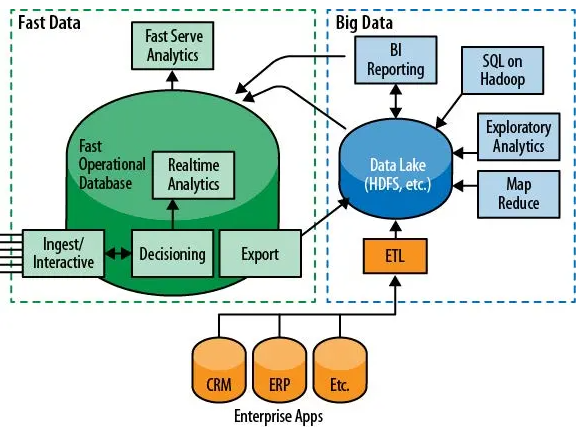
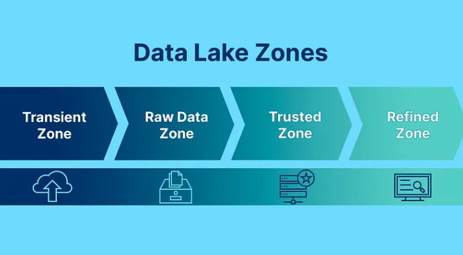

# Big Data

Peso de 25% na prova

---

## 1. O que é Big Data

> O que é Big Data, quais seus principais desafios (armazenamento, integração, análise e suporte "Fast Data").

É uma nova geração de tecnologias e arquiteturas, desenhadas de maneira econômica para extrair **valor** de grandes **volumes** de dados, provenientes de uma **variedade** de fontes, permitindo alta **velocidade** na captura, exploração e análise dos dados.

O contexto tradicional de bancos relacionais apresenta limitações em escalonamento, surgindo a oportunidade de realizar **computação paralela** usando hardware de baixo custo.

### 1.1) 5 Vs do Big Data

**Volume**: quantidades de dados na ordem de TB, PB;
**Variedade**: dados em diversos formatos diferentes (logs, DBs relacionais, JSON, IOT);
**Velocidade**: dados chegando de forma contínua;
**Veracidade**: é preciso extrair informações confiáveis dos dados para tomada de decisão;
**Valor**: só faz sentido ter uma infra de big data, se isso traz algum valor (financeiro, por ex.).

### 1.2) Fast Data

[Fonte](https://blog.dsacademy.com.br/fast-data-a-evolucao-do-big-data/)

Por muito tempo, o volume foi o foco no Big Data, mas cada vez mais o mundo muda de uma forma mais rápida, e para garantir competitividade, as empresas precisam extrair valor dos dados em formatos variados com maior velocidade.

Fast Data é coletar os dados em tempo real para tomada de decisão.

Em arquiteturas fast data, diferente do processamento batch tradicional feito durante a noite, os eventos individuais são processados à medida que chegam, na ordem de milissegundos (processamento de streaming).

---

## 2. Tipos de Processamento

> Quais os tipos de processamento de dados, ETL vs ELT e análise de complexidade e aplicabilidade em cenários reais.

---

## 3. Camadas de Dados

> Camadas de dados e sua relevância (Source of Record, Source of Truth, Specialized).

Um Data Lake é uma estrutura que visa armazenar um volume imenso de dados provenientes de diversas fontes.

Porém, se mal gerenciado, pode gerar um cenário de falta de controle sobre quais informações estão disponíveis, onde elas se encontram, por quanto tempo são válidas, quem deveria ter acesso e etc.

Para evitar isso, é eseencial aplicar a **governança de dados**, tanto em rotinas operacionais quanto nos frameworks usados na arquitetura.

A prática da divisão em zonas ajuda na organização e a governança dos data lakes, evitando que a estrutura acabe descontrolada e desorganizada (virando um Data Swamp).

O padrão é a divisão do Data Lake em 4 zonas:

**Transient Zone**

Zona transitória onde os dados são ingeridos pelo Data Lake. Aqui pode-se iniciar o processo de governança com catalogação das origens e tipos de dados que estão entrando.

Depois que os dados ingeridos forem alocados na Raw Data Zone, os arquivos aqui são excluídos, tornando essa uma zona de arquivos temporários.

**Raw Data Zone**

Zona de dados brutos armazenados de todas as fontes relevantes, independente de quanto será consumido de imediato. Dados brutos que ainda não receberam tratamentos para serem consumidos em análises tradicionais.

**Trusted Zone**

Dados já tratados. Sofreram as transformações necessários para serem consumidos e já possuem garantias de Data Quality, podendo ser considerados exatos e confiáveis.

**Refined Zone**

Dados tratados e enriquecidos, estando prontos para serem consumidos por aplicações externas.

Justamente por esse uso, essa camada costuma ser construída com infraestrutura de bancos de dados relacionais (SQL Server, Oracle, etc.), facilitando a conexão com APIs e sistemas transacionais.

---

## 4. Tipos de dados

> Tipos de dados (estruturados, semiestruturados, não estruturado) e formatos comuns utilizados (izo, parquet, orc, avro, xml, json).

### 4.1) Dados Estruturados

* Esquema fixo;
* Formato bem definido;
* Conhecimento prévio da estrutura de dados;
* Simplicidade para relacionar informações;
* Dificuldade para alterar o modelo.

Exemplos: Tabelas de um banco de dado relacional.

### 4.2) Dados Semi-estruturados

 Categoria entre dados estruturados e não estruturados. Não se limitam a uma estrutura rígida como em bancos de dados relacionais, mas possuem metadados ou tags semânticas para serem gerenciados.

 Por exemplo, uma foto que você tira possui atributos estruturados como geotag, ID do dispositivo, carimbo de data/hora. Depois de salvá-la podemos atribuir outras tags a imagem como "animal de estimação" ou "cachorro".

 ### 4.3) Dados não estruturados

 Não possuem formato pré-definido. Pode ser um parágrafo de um livro, postagens de mídia social, imagens de satélite, etc.

---

## Métricas de qualidade

> Qual a importância e quais métricas de qualidade de dados devem ser utilizadas em pipelines de dados.

---

## Infraestrutura de Sistemas Distribuídos

> O que é o ambiente Hadoop, quais ferramentas o compõe, vantagens e desvantagens do paradigma de programação MapReduce.

---

## Framework Spark

> Suas características, conceitos, sintaxe, vantagens e desvantagens.