# Dataviz

Peso de 15% na prova

---

# 1. Melhores práticas e Data Storytelling

> Melhores práticas para criação de visualizações de dados e para criação de Data Storytelling.

---

# 2. Acessibilidade e boas práticas

Itens a serem levados em conta ao escolher uma paleta de cores:

- Diferentes tipos de Daltonismo;
- Variações de acordo com o modo de acesso (impressão preto e branco, tela de computador com configuração de cor alterada);

Dicas:

### 2.1. Fazer legendas diretas

Ao invés disso:
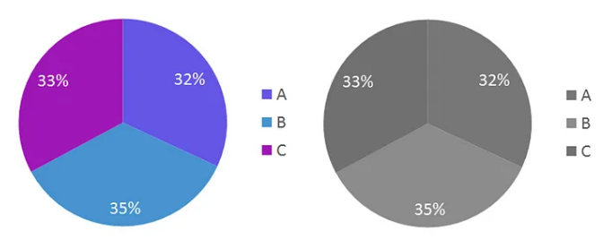

Usar isso:
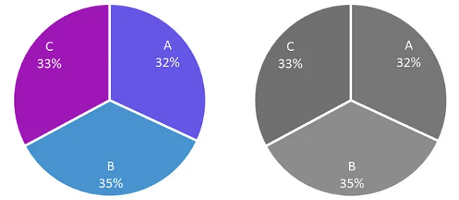

### 2.2. Use espaços em branco

Mesmo com legendas diretas, nem sempre é possível perceber a diferença entre as séries de um gráfico:

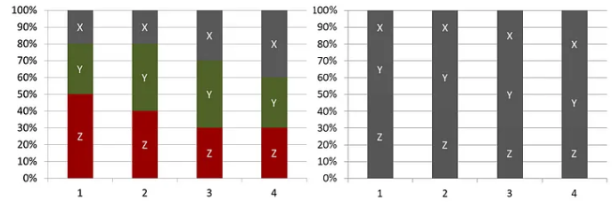

Podemos incluir espaços em branco entre as séries para facilitar a distinção:

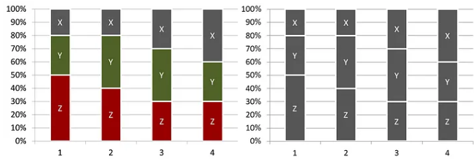

### 2.3. Varie traços e use formas em gráficos de linha

Usamos gráficos de linha para mostrar a variação de séries ao longo do tempo. Se distinguimos as séries apenas por cor, as informações podem se perder:

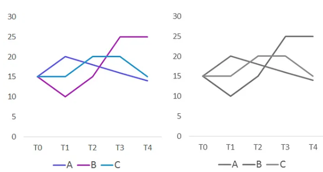

Podemos variar os traços e usar formas para facilitar a distinção.

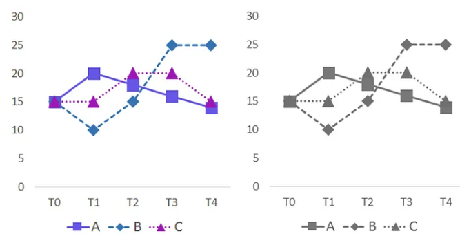

### 2.4. Use formas em gráficos de dispersão

Não fazer:
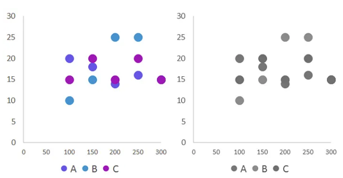

Fazer:
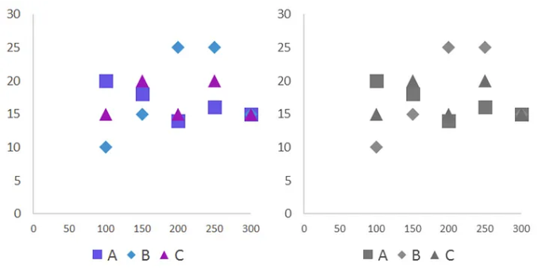

### 2.5. Use simbolos em tabelas

Não fazer:
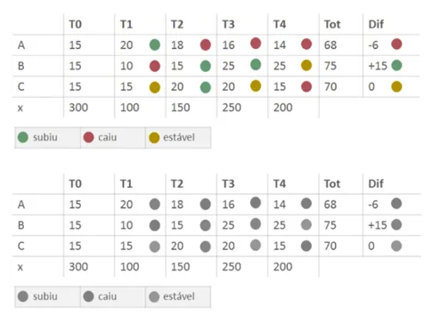

Fazer:
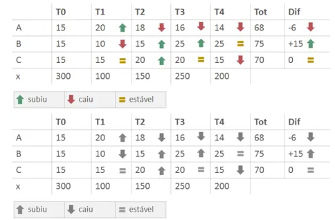

### 2.6. Use padrões e texturas em gráficos e mapas

Não usar:
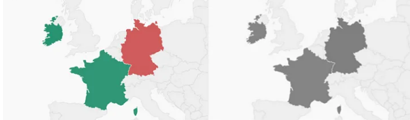

Usar:
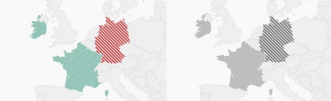

### 2.7. Use paletas com cores contrastantes

Evitar cores opostas no circulo cromático dando preferência para cores vizinhas.

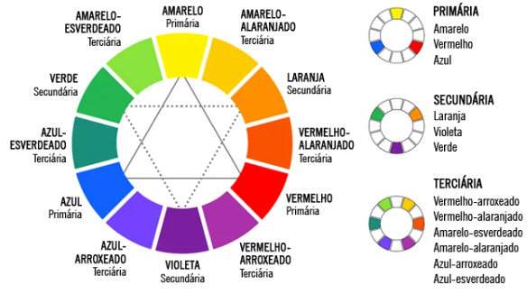

Para degradê, optar por escolher uma cor e alterar a opacidade gerando o seguinte gradiente:

* cor 1 em 100% de opacidade;
* cor 1 em 80% de opacidade;
* cor 1 em 60% de opacidade;
* cor 1 em 40% de opacidade;
* cor 1 em 20% de opacidade.

Isso gera 5 tonalidades para uso nos dashboards para uma mesma cor.

**Daltonismo**: levar em conta os diferentes tipos de Daltonismo.

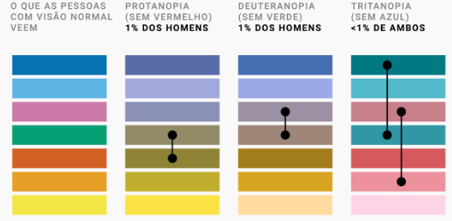

Para construção de gráficos com farol, optar por `Azul-Amarelo-Laranja` ao invés de `Verde-Amarelo-Vermelho`.

Algumas ferramentas online ajudam a escolher cores com constraste adequado:

* [WebAIM Color Constrast Checker](https://webaim.org/resources/contrastchecker/);
* [ColorBrewer 3.0](https://colorbrewer2.org/#type=sequential&scheme=BuGn&n=3).

### 2.8. Use um simulador de condições visuais

Existem ferramentas que permitem simular condições de visão diferentes para testarmos a acessibilidade das paletas de cores.

* [Coblis](https://www.color-blindness.com/coblis-color-blindness-simulator/);
* [Iamcal.com](https://www.iamcal.com/misc/colors/).

### 2.9. Descreva seus gráficos, tabelas e mapas

Redigir um parágrafo que sintetize a informação principal de cada visualização de dados é algo muito poderoso para a acessibilidade, pois:

* Deixa nossas visualizações acessíveis para pessoas cegas ou com baixa visão que usam softwares que leem os textos "por trás" de cada elemento visual;

* Ajuda pessoas que não estão acostumadas a interpretar gráficos, tabelas ou mapas.

Exemplo do preenchimento de um `texto-alt`:

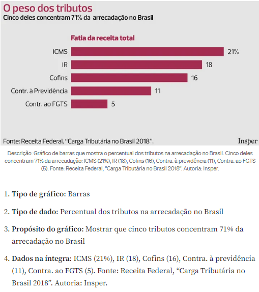

A descrição ficaria assim:

> Gráfico de barras que mostra o percentual dos tributos na arrecadação no Brasil. Cinco deles concentram 71% da arrecadação: ICMS (21%), IR (18), Cofins (16), Contra. à previdência (11), Contra. ao FGTS (5). Fonte: Receita Federal, “Carga Tributária no Brasil 2018”. Autoria: Insper.