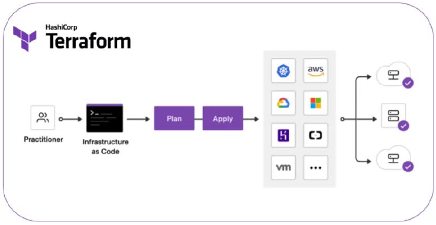

# DevOps

Peso de 8.5% na prova.

---

# 1. Fundamentos

> O que é DevOps e quais seus fundamentos.

---

# 2. Versionamento de Código

> Versionamento de código, GIT.

---

# 3. Observability

> Importância e boas práticas em Observability de sistemas.

---

# 4. Infra as Code

> IaC, Terraform.

**Infraestructure as Code (IaC)** é o gerenciamento de infraestrutura de forma descritiva como código. Isso garante:

* Que você provisione sempre o mesmo ambiente (replicabilidade);
* Permite o versionamento da infra;
* Escalabilidade.


**Ferramentas de IaC**

- Hashcorp Terraform
- Terragrunt
- Pulumi
- AWS CloudFormation

### 4.1. Terraform

Produto criado pela Hashcorp para definir recursos de infraestrutura em nuvem e local.

Tem 3 estágios:

- Gravação: definição de recursos de provisão;
- Planejar: criar o plano de provisionamento de infraestrutura;
- Aplicar: começa a implementar as operações sugeridas na ordem correta e com relação às dependências dos recursos de infraestrutura.

Via comando seriam as operações:

````h
// examina arquivos de configuração e instala providers
terraform init

// cria o planejamento das operações a realizar e exibe
terraform plan

// aplica o plan
terraform apply

// destroi a infra provisionada
terraform destroy
````

Esboço de funcionamento do Terraform:



> **Observação**: Terraform e Ansible são diferentes. Terraform é uma ferramenta para criar um ambiente, ou elementos no cloud provider. Ansible é usado depois, para configuração da infraestrutura. São aliados, se complementam.

Os arquivos do terraform são de extensão `.tf` e possuem os seguintes blocos:

- `terraform{}`: contém a configuração do Terraform. Isso inclui detalhes sobre os provedores (providers) necessários;

- `provider{}`: configuração do provedor;

- `resource{}`: recurso a ser provisionado.

Exemplo de um código do terraform `.tf` para provisionar um conteiner do Docker.


